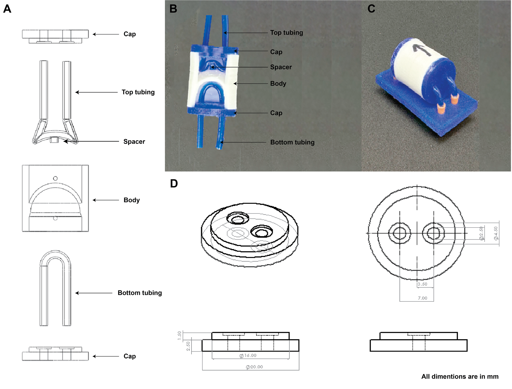
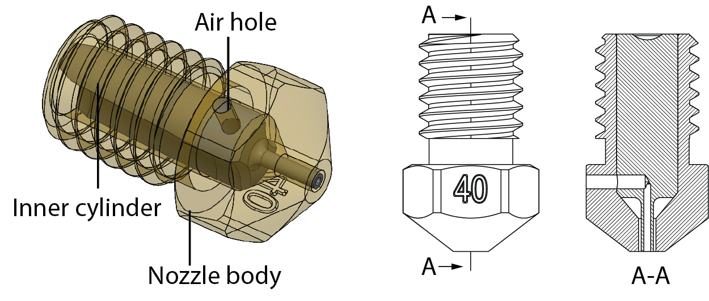
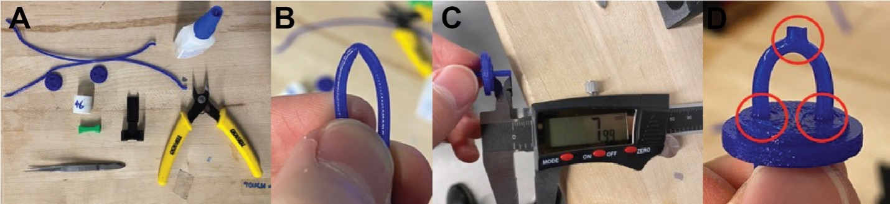
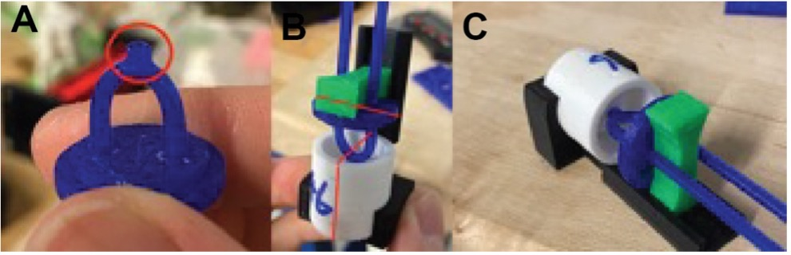
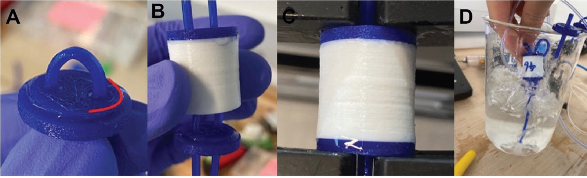
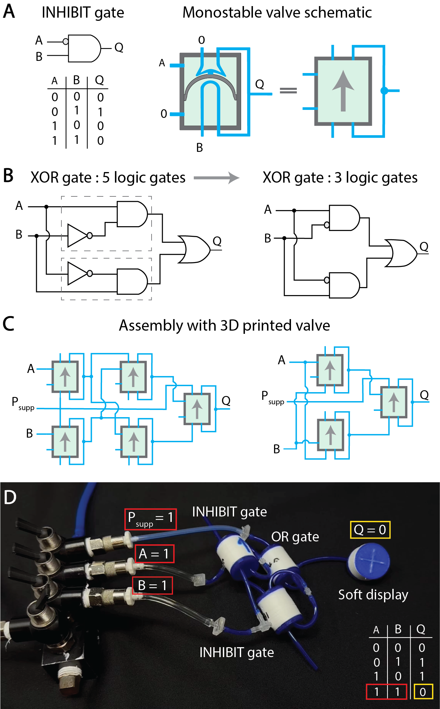
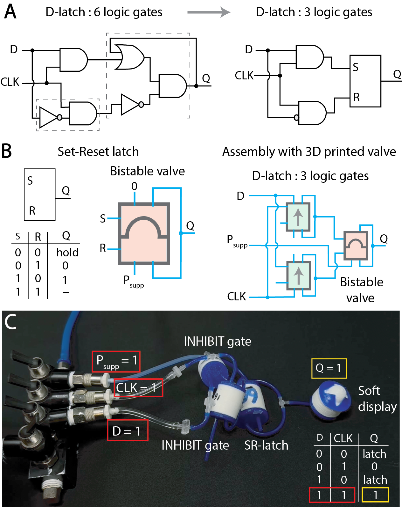

# 3D Printed Valve
A 3D printed valve is a device that has a membrane that opens or closes tubing depending on the way the membrane is flipped; acting analogously to a CMOS transistor in an electrical circuit. This 3D printed soft fluidic valve can be configured to function as either an OR-gate, an AND-gate, or a NOT-gate.

This repository will serve as a user guide for the 3D printable valve. Topics covered include: (1) Fabrication and Assembly Guide, (2) Device Characterization, (3) Demonstrations, (4) Tube Extruding Nozzle Design, and (5) Feedback from using the device as an educational tool. Since the design is based on the valve concept introduced in the "Digital Logic for Soft Devices" paper [2], we occasionally refer to our designs as soft bi-stable/mono-stable valves as well.

## Fabrication and Aseembly Instructions

## Bill of material:
* Mk3S 3D printer (https://www.prusa3d.com/product/original-prusa-i3-mk3s-3d-printer-3/)
* Filaflex 60 A filament(https://recreus.com/gb/filaments/1-filaflex-60a.html)
* Ninjaflex 85 A filament (https://ninjatek.com/shop/ninjaflex/)
* Extruding nozzle

The 3D printed soft fluidic valve consists of 3 components (Figure 1A)
* Body with membrane 
* Caps (2x)
*	Extruded tubing (2x) 

 
Figure 1. The 3D printed soft fluidic valve. A) The exploded view of the valve along with its components B) Cut view of 3D printed valve and C) fully assembled valve D) CAD file of the cap.

## Fabrication of Body and Caps
The 3D printed valve is categorised into two design, monostable- and bistable design. We uploaded the CAD file, stl. file, gcode profiles for body and caps in the CAD folder of this repository. 

Here is the video of 3D printing body and caps on Prusa Mk3S printer (https://youtu.be/z_FRGywTmZA)

## Fabrication of extuding tubing

 

This figure shows 3D model of the tube-extruding printing nozzle including a schematic and a cross-sectional view. 

[https://www.youtube.com/watch?v=pW0tsSzDVcI] is a video showing the tube-extruding in progress. We used a Prusa Mini+ FDM printer ($399) and the open-source Pronterface
software to control the printer. To extrude the tubes, we use G-code commands to configure the print parameters and initiate the tubing extrusion process. Using Ninjaflex 85A, we set the nozzle temperature to 235 ◦C at 100% fan speed and extruded 1000 mm of filament. Here are the commands to extrude tubings. 
* G91			# relative positioning
* (G0 z10)		# test if relative positioning work
* M83			# relative extruder positioning
* M106 S255		# full fan speed
* M104 S235		# temperature to 235	# wait for temperature to reach 235
* g0 f150 e1000		# extrude 1000 mm of filament with speed of 150 	# 1000 is the max length that can be sent one time

## Assembly of 3D printed valve 
Once you have all the components, we will investigate assembly process. You will need following tools for the assembly process (Figure 2A).
*	Flush cutter
*	Superglue
*	Twizers
*	Gloves
*	Vernier caliper
*	Custom 3D printed assembly tool

 
Figure 2. Assembly process of 3D printed valve. A) The tools and components required for the assembly of the valve B) Showing a bad tube / bad side for assembly that will make the tube kink by itself C) Measuring the length of the bottom tube D) Providing locations to apply glue for the top tubing with the spacer.

Please follow provided instructions for the assembly process of the 3D printed valve
1.	First, we will start with the cap and tubing. The tubings are extruded using a custom nozzle. Also check for thinner side of tube and put the thicker side inwards (to not easily kink). Figure 2B shows a wrong configuration where the thinner side of tubing is facing inward, and the tube will kink by itself. 
2.	NOTE: This step is especially important. It is one of the most common causes of failure. Feel free to throw away pieces of tubing that always kink by itself in any direction (Figure 2B).
3.	We use following tube lengths for the top and bottom side of the tubing.
*	Top: 11.5 mm + 1.5 mm spacer
*	Bottom: 8 mm
4.	Before sticking the tubes, soften them by crushing it in different directions (kink every single part of tube, thus tube is less prone to kink by itself) (Figure 2B).

 
Figure 3Top tube assembly process. A) Applying glue to the spacer of the top tubing B) Use the 3D printed tool to make sure the tube is perfectly perpendicular and C) applying slight pressure to stick spacer to the membrane

5.	First, we will start inserting the top tube through the holes of top cap. Make sure the distance for the top tube is 11.5 mm and bottom tube is 8 mm. Please measure the distance using vernier caliper (Figure 2C). The 1 mm spacer is the part of the tube, cut 1.5 mm piece and attach to the tubing as shown. Apply glue to top of tube and stick to the spacer (Figure 2D).
6.	Write down length of tube at the bottom of cap (write “8” or “11.5+1.5”). When glue is dried, start assembling the cap to the body.
7.	Apply half a drop / a drop of glue to top of spacer. With help of the printed tool, slightly press the spacer at the center of membrane (Figure 3A and 3B).
8.	Make sure that the tube is perfectly perpendicular to the holes on membrane body (all three lines in Figure 3B are perpendicular to each other) (Figure 3C). When glue dries, start to glue top cap to the body.
9.	Make sure to protect your hands with glues in this step. Put lots of glue around the cap and push the cap inside body. Glue should overflow, and it will help seal the parts.
10.	For better gluing, better to apply some glue to top surface of the cap (Figure 4A). This will make cap stick to body from the inside. 
11.	Follow the same procedure for the bottom tube, here you will not need any spacer and no need to glue the bottom tubing to the membrane. 
12.	Put some clamps from both side of the cap to hold the three parts together (Figure 4B and 4C). Start with the cap without forces from membrane, which is bottom cap. This way it’s easier. It’s fine to destroy some gloves at this point.

 
 
Figure 4. Complete valve assembly process. A) Applying glue to  the cap for gluing to body B) Putting both the bottom and top cap together and C) using clamps D) Test the device to confirm that it is not leaking and correctly kinking. 

13.	Also, don’t apply too much pressure when sticking them together. Having a lot of glue between cap and body makes a very robust seal and helps the structure retain high pressure. It’s encouraged to apply more glue to ensure air-tightness. This is the final chance to fix non-perpendicular problem. Make sure to make it perpendicular.
14.	Once you have the valve entirely assembled, please check for the airtightness (Figure 4D).
15.	Configure the valve to NOT gate and check if you are able to obtain that behavior.

4.	Configuration process (First for the testing purpose, you will configure the device into NOT gate. Here is the configuration schematic. You will include the truth table of the device in the lab report. Also, you will configure the device into AND gate and OR gate, include the truth table for the configurations.)

Note:
The CAD file, stl file, gcode, printer configurations are also provided in the same folder.

## Characterization of the Device

<!--

    
    

    hello
    

    

-->
<!--

    

        
    

    

        

        Optimised XOR gate. (A) An INHIBIT gate along with the truth table and schematic representation. (B) The circuit diagram of XOR gate with five logic gates. When we optimise the XOR gate using an INHIBIT gate, we only require three logic gates. (C) The assembly of a XOR gate from our 3D printed valves. (D) Implementation of an optimized XOR gate with the output directly connected to a soft display. When both inputs of the XOR gate are HIGH ($A=1$ and $B=1$), the output is LOW ($Q=0$).
        <!-- This demo shows how making the XOR gate from the mono-stable valves. It also showcases how the INHIBIT gate configuration can dramastically simplify the number of gates and connections in a circuit. This design trick is also evident in subsequent demos. -->
        

    

<!--

 

    

        
    

    

        

        Optimized D-latch circuit. (A) The diagram of a conventional D-latch circuit from six logic gates and the optimized circuit from three logic gates using an INHIBIT gate with a set-reset latch. (B) We modified the 3D printed valve design to create a bistable device; bistable devices act as non-volatile SR latches. (C) Implementation of a D-latch using our 3D printed valves and a soft display. When both the data and clock inputs are HIGH ($D = 1$ and $CLK = 1$), the output turns HIGH ($Q=1$).
        

    

-->

## Link to supplemental resources
This file contains links to the supplemental information on how to construct the soft fluidic valve. It also includes important physical considerations for the operation of the valve. 

[1] A soft, bistable valve for autonomous control of soft actuators  
P. Rothemund, A. Ainla, L. Belding, D.J. Preston, S. Kurihara, Z. Suo, G.M. Whitesides  
[Science Robotics, 3(16), 2018](https://gmwgroup.harvard.edu/files/gmwgroup/files/1301.pdf)\
\
[2] Digital Logic for Soft Devices  
D.J. Preston, P. Rothemund, H.J. Jiang, M.P. Nemitz, J. Rawson, Z. Suo, G.M. Whitesides  
[Proceedings of the National Academy of Sciences (PNAS), 1820672116, 2019](https://gmwgroup.harvard.edu/files/gmwgroup/files/1318.pdf) \
\
[3] A Soft Ring Oscillator  
D.J. Preston, H.J. Jiang, V. Sanchez, P. Rothemund, J. Rawson, M.P. Nemitz, W.-K. Lee, Z. Suo, C.J. Walsh, G.M. Whitesides  
[Science Robotics, 4(31), 2019](https://gmwgroup.harvard.edu/files/gmwgroup/files/1323.pdf) \
\
[4] Soft Non-Volatile Memory for Non-Electronic Information Storage in Soft Robots  
M.P. Nemitz, C.K. Abrahamsson, L. Wille, D.J. Preston, A.A. Stokes, G.M. Whitesides  
[IEEE Soft Robotics Conference, New Haven, 2020](https://cpb-us-w2.wpmucdn.com/wp.wpi.edu/dist/e/484/files/2021/09/Soft_Non-Volatile_Memory_for_Non-Electronic_Information_Storage_in_Soft_Robots.pdf)  

